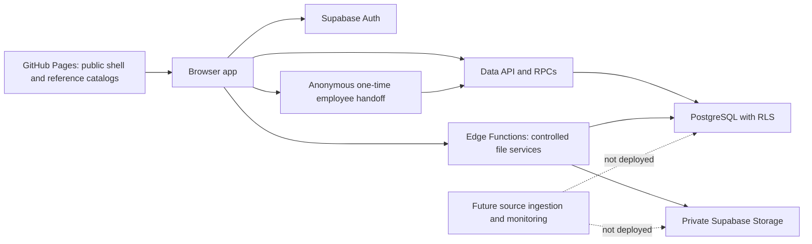

# SafetyOps Architecture

## Current system boundary

SafetyOps is a static browser application intended for GitHub Pages. GitHub
serves the shell and regulatory reference artifacts; authenticated tenant data
is intended to come from Supabase after RLS authorizes the user.

This is the target architecture represented by source. The public shell has an
exact signed release process. Migrations `016` through `018` passed hosted
rollback compilation, were applied on 2026-08-03, and have ledger entries bound
to their reviewed source SHA-256 values. Migration `017` live checks prove the
candidate-scope boundary; migration `018` proves immutable collection labels
for all 123 Drive originals, their exact 120/3 collection split, RLS, grants,
and enabled guards. Named employee-workflow catalog checks also passed, and the
employee-document and hardened Drive-ingest Edge Functions are active. That
evidence does not prove legacy migration checksums, the full cross-role and
tenant-isolation matrix, configured scanner behavior, or complete workflows.

## Public layer

- `index.html`, `styles.css`, and `app.js` form the static application.
- `supabase-config.js` is public by design and contains only the dedicated
  project URL and its publishable key.
- Persistent Supabase sessions remain disabled on the shared account-level
  `github.io` origin. Enabling them requires a dedicated custom domain and
  corresponding Auth/Edge origin allowlists.
- `data.js` and the public safety-program files contain null company/user values
  and empty tenant collections.
- `tenant-bootstrap.js` can load ignored private fixtures only on localhost and
  only when explicit development flags are enabled.
- `osha-reference.js` contains the full 1,547-record structural index for eCFR
  29 CFR Chapter XVII with `currentThrough: 2026-07-29`.
- `state-osha-reference.js` contains 24 curated Oregon records, including 23
  manufacturing-focused priorities, plus 10 Washington and 10 California
  starter records. Oregon official links were checked 2026-08-06; the
  Washington and California starter-link check date remains 2026-07-30. It
  explicitly claims no source-content hash or complete legal coverage.
- `scripts/build-static.js` creates the allowlisted `dist` artifact.
- `scripts/verify-public-build.mjs` checks empty tenant seeds, tenant-free
  regulatory mappings, the exact 12-file `dist` allowlist, and the complete
  sanitized release tree for known tenant markers, Drive identities,
  credentials, private directories, and symbolic links. Git-tracked
  private/generated directories, environment files, debug logs, and local
  Supabase configuration are hard failures rather than scanner exclusions.
- Local release approval requires the ignored private tenant denylist and
  Ed25519 private key. Attestation schema v2 signs exact hashes and byte sizes
  for both the deployable artifact and every sanitized release-tree file. The
  attestation JSON/signature alone are excluded to avoid circular hashing.
  CI verifies the strict schema, public-key signature, both aggregates, and
  both exact file lists.

The working source repository contains prior private material in history, so
only the sanitized single-root release repository may be published.

## Browser and data layer

`app.js` initializes Supabase only when public connection values are present.
Otherwise it renders a configuration-required state. After authentication:

1. the app resolves one active `company_memberships` row;
2. it loads company, location, profile, regulatory, inspection, incident,
   action, training, document, member, audit, safety-program, form, assignment,
   submission, lineage, and file-link records scoped by `company_id`;
3. it maps authorized records into browser state; and
4. it renders empty states when a tenant has no operational records.

Inspection submission uses
`submit_inspection_with_regulatory_evidence`, while company/location onboarding
and terminal safety-program submission use narrow RPCs. Incident, training,
corrective-action, and draft-form writes use RLS-filtered Data API paths. These
browser paths depend on database-side authorization; hidden controls are not
treated as the security boundary (LFES-SEC-002).

The employee tablet path is intentionally different. An authenticated safety
user creates an assignment and requests a 15-minute one-time capability. A
separate no-opener tab uses the public key and capability but receives no
facilitator Auth session. PostgreSQL stores only the token's SHA-256 digest,
validates answers against the pinned published form, atomically consumes the
handoff, and creates append-only completion evidence. Employees do not need
accounts. See `employee-safety-workflows.md`.

Workspace reads now have explicit collection caps, generally 30 to 1,000 rows.
They are bounded first loads, not pagination: deterministic cursors/ranges,
truncation indicators, and detail-on-demand remain required before scale.

### Browser information architecture

The browser shell presents the existing data contracts through four
intent-based groups:

- **Today:** a task-first coordinator inbox and cross-location Safety monitor;
- **Run safety:** forms, committee work, training, incidents, and action items;
- **Library & compliance:** approved forms/programs, documents/resources, and
  the OSHA guide; and
- **Company:** employees, locations, and settings.

This navigation is a presentation boundary, not an authorization boundary.
Supabase RLS, narrow RPCs, private Storage, and Edge Function checks remain
authoritative regardless of whether a control or record appears in the shell.

The operational library also keeps three concepts separate: interactive form
templates, readable or signable document resources, and the Drive-derived
import/source archive. The archive preserves originals, folder lineage,
classification, access review, and conversion provenance, but it is not the
default work queue or worker-facing menu. Completed submissions and signatures
remain immutable operational evidence rather than files in that archive.

## Database layer

Migrations must be applied in filename order:

1. `202607300001_initial_safetyops.sql`: tenant, locations, roles, operational
   forms, inspections, incidents, actions, training, documents, evidence, audit,
   RLS, and narrow worker RPCs.
2. `202607300002_regulatory_traceability.sql`: source/version lineage,
   requirements, releases, changes, location profiles, applicability, mappings,
   and regulatory evidence.
3. `202607300003_safety_programs.sql`: versioned programs, form schemas,
   assignments, submissions, answers, signatures, acknowledgements, sources,
   private object metadata, audit, and RLS.
4. `202607300004_form_originals.sql`: immutable original/template file links,
   service-controlled upload sessions, metadata authorization, and file RLS.
5. `202607300005_company_onboarding.sql`: historical atomic company onboarding
   revision retained in migration history and retired by migration `011`.
6. `202607300006_state_jurisdiction_onboarding.sql`: OR/WA/CA seeds and the
   historical four-argument company onboarding revision, retired by migration
   `011`.
7. `202607300007_form_file_access_ledger.sql`: service-only allow/deny events
   for signed form-file access.
8. `202607300008_company_location_onboarding.sql`: authorized additional
   location creation with a draft, review-required jurisdiction assignment.
9. `202607300009_inspection_regulatory_trace.sql`: exact published-template
   inspection RPC, idempotency, immutable regulatory contexts, typed evidence
   links, and acknowledgement audit coverage. Draft/review-required profiles
   are captured as `review_required` without emitting compliance evidence.
10. `202607300010_lfes_role_and_form_integrity.sql`: database-side read-only
    auditor enforcement, scoped personnel visibility, immutable inspection
    tenant/location/template identity, active access revalidation, current
    program/profile applicability, canonical form contexts, server-derived
    signature/final evidence hashes, and answer/attachment freezing after
    signature. A browser
    signature insert supplies only pinned submission, template, field, signer,
    and optional artifact IDs. PostgreSQL derives the signer name from
    profile/JWT context, company role, method from the pinned field type, intent
    from its label, timestamp, unsigned-payload digest, canonical signature
    record, and signature hash.
11. `202607310011_auth_and_tenant_integrity.sql`: service-only invite-owner
    bootstrap with system provenance; retirement of both browser onboarding
    overloads; one-active-company, attributable membership audit, and
    last-administrator invariants; state-aware location enforcement; corrected
     profile supersession; database-derived jurisdiction review; and
     resolved-jurisdiction profile/program gating.
12. `202607310012_pgcrypto_schema_compatibility.sql`: hosted-Supabase pgcrypto
    namespace compatibility and original-search-path-preserving repair for
    hash-dependent functions installed by migrations `002` through `009`.
13. `202607310013_drive_form_archive.sql`: two-phase private Drive-export
    archive ingestion, immutable source/candidate provenance, and access
    ledgers.
14. `202607310014_candidate_download_review_guard.sql`: candidate download
    denial for rejected, duplicate, and superseded review states.
15. `202607310015_drive_ingest_invalidation_ledger.sql`: append-only ingest-run
    invalidation without rewriting frozen ingest evidence.
16. `202608030016_employee_safety_workflows.sql`: employee directory and exact
    location assignments, committee minutes, employee-owned actions and
    training, employee PDF evidence, and 15-minute one-time employee form
    handoffs with immutable submission hashes.
17. `202608030017_candidate_access_review.sql`: company-visible versus
    safety/admin-private Drive candidates, fail-closed sensitive-record rules,
    manager review transitions, scoped downloads, and append-only review audit
    events.
18. `202608030018_source_collection_hierarchy.sql`: immutable top-level Drive
    collection labels derived from frozen manifests, exact folder-tree
    projection without raw paths, and server-owned derivation for future
    candidate inserts.

The critical intended boundaries are `private.is_company_member`,
`private.can_manage_company`, `private.can_access_location`, RLS policies,
foreign keys that repeat `company_id`, and pinned `search_path` values on
security-definer functions. Hosted application and ledger evidence for
migrations `016` through `018`, plus the final `010`–`012` compatibility sequence,
are proven;
exact legacy file identity and the complete runtime role and tenant-denial
matrix are not.

## Private file boundary

The intended original-form download path is:

1. authenticated browser requests RLS-filtered metadata through
   `get_safety_program_form_file_metadata`;
2. the browser invokes `sign-form-file`;
3. the function revalidates user access and immutable object metadata;
4. only clean, verified bytes receive a five-minute signed URL; and
5. the service writes an allow/deny access event.

The form-original download function and separate employee-PDF function are
active with JWT verification, but authorized hosted Storage behavior is not yet
proven. There is no live prepare/quarantine/scan/commit upload pipeline for form
originals. The employee-PDF service uses fenced resumable processing leases,
format/size/hash checks, quarantine, and exact-hash scanner attestations. With
no approved scanner configured, the document remains non-releasable as
`upload_pending`/`unavailable`; download and signing require `clean`. Optional
localhost staging is device-local development state, not company evidence.

## Regulatory traceability

Location onboarding never makes a legal determination. A state selection
creates a draft profile and `requires_review` assignment. Migration `009` is
designed to allow the operational inspection while capturing that incomplete
context immutably as `review_required`; it emits zero compliance-evidence links
until the profile, jurisdiction, applicability assessment, exact mapping,
requirement, and release are reviewed, approved, published, and effective.

The federal artifact is a full structural/link index as of 2026-07-29. The
state artifact is deliberately a 44-record curated catalog with an Oregon
manufacturing-first index, not a
complete state corpus, and claims no state source-byte hash. Qualified review
and controlled source snapshots remain required. Nothing in the reference
layer is an LFES or regulatory compliance certification.

## Open architecture boundaries

- no clean local PostgreSQL replay, applied-file checksum proof for legacy
  versions, or hosted catalog assertion suite;
- no hosted cross-company, cross-location, or role denial tests;
- no configured malware scanner, source-ingestion worker, scheduler, or
  change-monitoring worker;
- bounded query caps without user-visible pagination or truncation handling;
- no offline mutation/conflict design;
- no database backup, rollback, or forward-correction runbook;
- no live form-original prepare/quarantine/malware/commit upload service;
- no malware scanner, PDF template/version lineage, retention/legal-hold
  decision workflow, recurring-training renewal worker, or server-owned
  corrective-action closeout;
- possible legacy IndexedDB staging blobs on devices used by earlier builds;
- concentrated browser responsibilities in `app.js`.

These boundaries are release gates in `RELEASE_CHECKLIST.md`.
